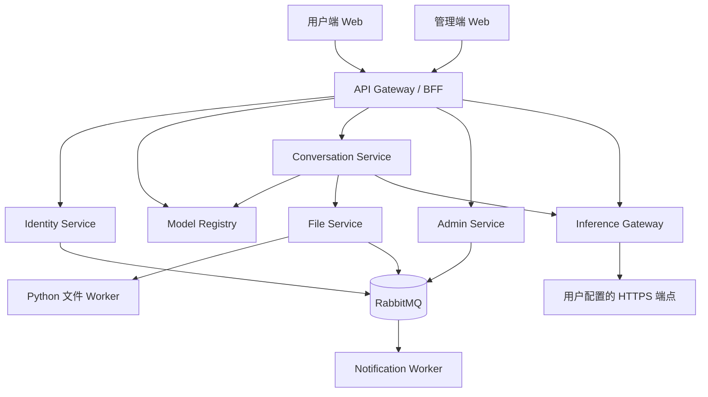

# Autumn Wind Ai 产品与架构设计

日期：2026-07-18

状态：设计已确认，等待书面规格审阅

项目名称：Autumn Wind Ai

## 1. 产品概述

Autumn Wind Ai 是一个多用户 SaaS 对话平台，交互风格参考 DeepSeek，但不复制其品牌与具体实现。平台在 V1 不提供模型 API 端点，每位用户自行安全配置 OpenAI-compatible 端点、API Key 和模型。

模型行为由能力配置驱动。用户添加模型时，需要显式声明输入、输出和协议行为能力。前端、附件处理链和推理网关根据这些声明工作，不根据模型名称猜测能力。

V1 支持：

- 邮箱密码账户，以及可配置的公开注册。
- 用户私有的 OpenAI-compatible 端点和 API Key。
- 文本对话和流式输出。
- 图片理解和图片生成。
- 文档附件；模型不支持原生解析时，由网站服务端提取内容。
- 视频上传后的元数据和抽帧理解。
- 简易管理系统，用于用户、注册、邮件、配额、端点策略、站点信息、审计和服务健康管理。

V1 不包含订阅付费、知识库、共享工作区、管理员公共模型、Anthropic/Gemini 原生协议或视频生成。

## 2. 产品原则

1. 用户数据、端点、模型、凭据、文件和会话必须按租户隔离。
2. 从用户视角看，API Key 只可写入和替换，不能再次读取；完整密钥永不返回浏览器。
3. 模型能力由用户显式配置，不根据名称推断。
4. 不支持的附件必须明确失败或使用已声明的降级路径，不能静默遗漏内容。
5. 服务拥有自己的数据，只通过带版本的 API 或事件通信。
6. 服务可以独立部署，但首版保持粗粒度，避免把每张表拆成一个服务。
7. 即使模型费用由用户自己的 API Key 承担，V1 仍需使用配额保护平台资源。

## 3. 用户与角色

V1 只有两种角色：

- `user`：管理个人端点、模型、会话、附件和资料。
- `admin`：管理用户和平台策略，但不能读取用户完整 API Key。

首个管理员通过部署初始化流程创建。更细粒度的 RBAC 只有在出现明确需求后才引入。

## 4. 页面参照与视觉方向

项目只借鉴交互模式和信息架构，不复制品牌、受版权保护的素材或像素级样式。

| 参照 | 在 Autumn Wind Ai 中的用途 | 明确不做的内容 |
| --- | --- | --- |
| [DeepSeek Chat](https://chat.deepseek.com/) | 克制的认证页面、安静的聊天界面、紧凑的会话层级和低干扰输入框 | 不复制 DeepSeek Logo、品牌色体系、文案或精确布局 |
| [TypingMind 文档](https://docs.typingmind.com/) | BYOK 引导、从设置进入模型的心智模型、服务商与模型分离 | V1 不引入高级 Agent、插件、团队或许可证页面 |
| [Open WebUI 对话功能](https://docs.openwebui.com/features/chat-conversations/chat-features/) | 会话历史、模型选择、推理内容展示和附件状态 | 避免暴露其庞大功能集合，也不把输入框变成密集工具栏 |
| [LibreChat 管理后台](https://www.librechat.ai/docs/features/admin_panel) | 独立管理界面、可搜索用户表格、配置表单和服务端权限校验 | V1 不采用高级用户组、自定义角色或授权模型 |

### 4.1 视觉方向

- 登录后第一屏直接进入产品界面，不制作营销式落地页。
- 聊天界面使用窄会话侧栏、克制的顶部栏、易读的消息列和尺寸稳定的底部输入框。
- 浅色与深色主题以中性色为主，只使用一种克制的操作强调色；不使用大面积渐变或装饰性卡片。
- 管理后台强调信息密度和工作效率：左侧导航、页面工具栏、表格、筛选器、分区设置，以及用于聚焦编辑的抽屉或对话框。
- 端点与模型设置使用主从式布局。端点凭据和连接状态与模型能力控制分开呈现。
- 附件标签需要稳定展示上传和解析状态，不能因状态变化改变输入框尺寸。
- 图片生成使用同一产品壳内的独立模式，参数放在结果区域旁，不隐藏在聊天文本中。
- 桌面端和移动端保留相同工作流。移动端侧栏变为抽屉，密集表格显示高优先级列，并提供详情视图。

### 4.2 页面地图

用户端页面：

- 登录、注册、邮箱验证、忘记密码和重置密码。
- 对话和会话搜索。
- 图片生成。
- 端点列表和端点编辑。
- 模型列表和能力编辑。
- 个人资料、安全、用量和存储。

管理端页面：

- 总览和服务健康。
- 用户列表和用户详情。
- 注册与认证策略。
- 邮件服务器和模板。
- 配额与文件策略。
- 端点域名白名单和黑名单。
- 站点信息、公告、用户协议和隐私政策。
- 审计与运行事件。

## 5. 技术栈

### 5.1 前端

- React、Vite 和 TypeScript。
- React Router 负责路由，TanStack Query 负责服务端状态。
- Tailwind CSS、Radix UI 基础组件和 Lucide 图标。
- 使用 SSE 接收模型输出流。
- 使用 Playwright 验证端到端流程和响应式页面。

前端工作区包含独立的用户端和管理端应用。两者可以共享设计 Token、无障碍基础组件、API Client 和由契约生成的类型，但不能共享页面级业务状态。

### 5.2 Java 服务

- 以 Java 21 LTS 为基线。
- 使用与 Java 21 兼容且仍受维护的 Spring Boot 版本，并在构建中锁定具体版本。
- 使用 Maven 父级 BOM，每个服务模块都可以独立构建。
- Spring Cloud Gateway 负责边缘路由和网关策略。
- Spring Security 负责用户会话和服务授权。
- 常规控制面服务使用 Spring MVC。
- 只有 API Gateway、Conversation Service 的流式链路和 Inference Gateway 使用 Spring WebFlux。
- 使用 PostgreSQL，每个服务拥有独立 schema。
- 常规服务使用 Spring Data JPA；响应式数据访问只允许出现在确有必要的服务中。
- 每个服务独立拥有和执行 Flyway 迁移。
- RabbitMQ 用于领域事件和后台任务。
- Redis 用于限流、短期流状态和缓存，不保存持久业务事实。
- 使用 S3-compatible 对象存储，本地开发使用 MinIO。
- 同步接口使用 OpenAPI，异步事件使用带版本号的 JSON Schema。

### 5.3 Python 文件 Worker

- 使用 Python、精简的 FastAPI 内部控制接口和 Celery Worker。
- 使用 PyMuPDF、python-docx、openpyxl 和 python-pptx 提取文档内容。
- 使用 Pillow 和 FFmpeg 处理图片、元数据、缩略图和视频抽帧。
- OCR 通过可插拔适配器支持 Tesseract 或 PaddleOCR。

Python 只用于 File Service 限界上下文，不实现认证、对话、模型注册、管理后台或服务商凭据处理。

### 5.4 基础设施与运维

- 开发环境和初期小规模部署使用 Docker Compose。
- 扩展需要出现后，同一批容器镜像可以部署到 Kubernetes。
- 使用 OpenTelemetry 串联 Trace 和关联 ID，使用 Prometheus-compatible 指标和结构化 JSON 日志。
- 定义 `SecretStore` 抽象。V1 默认使用 AES-256-GCM 信封加密，部署主密钥通过 Secret 挂载；生产环境可以替换为 Vault 或云 KMS/Secret Manager 适配器。
- 测试工具包括 Testcontainers、JUnit 5、WireMock、Vitest、Pytest 和 Playwright。

## 6. 服务边界

### 6.1 API Gateway / BFF

负责：

- 外部路由、请求体大小限制、粗粒度限流、CORS、CSRF 集成和关联 ID。
- 校验用户会话，并向内部服务传递签名后的身份声明。
- 转发 SSE，并关闭代理缓冲。

不负责：

- 用户、会话、模型能力、服务商凭据或后台设置。
- 构造服务商请求。

网关必须先删除客户端提交的所有内部身份 Header，再写入自己的签名身份声明。

### 6.2 Identity Service

负责：

- 用户、密码哈希、会话、邮箱验证、密码重置、账户状态和角色。
- 注册开关、邮箱域名、验证、密码和登录锁定策略。
- 在注册和认证时执行上述策略。

不负责：

- SMTP 投递和 SMTP 凭据、模型凭据、用户配额、会话或文件。

### 6.3 Model Registry

负责：

- 端点元数据、凭据引用、模型记录、模型能力定义、连接测试结果和模型启用状态。
- 校验模型能力组合是否合法。

不负责：

- 会话或对外服务商调用。
- 在普通业务表中保存明文凭据。

### 6.4 Conversation Service

负责：

- 会话、消息、生成任务生命周期、上下文组装、上下文预算决策和最终的标准化用量记录。
- 公共对话 API 和用户可见的生成状态。

不负责：

- 服务商特有的请求体、凭据或文件解析。

### 6.5 Inference Gateway

负责：

- 服务商适配器、请求标准化、流事件标准化、服务商超时、重试策略、熔断和逐请求 SSRF 校验。
- 作为唯一允许访问用户配置模型端点的业务服务网络出口。
- 调用期间临时解析服务商凭据。

不负责：

- 会话历史、用户身份记录、文件存储或持久化服务商凭据。

V1 适配器：

- OpenAI-compatible Chat Completions。
- OpenAI-compatible 图片生成。

后续可以增加 Anthropic、Gemini 和异步视频生成适配器，而不修改 Conversation Service 的核心契约。

### 6.6 File Service 与 Python Worker

负责：

- 上传授权、文件元数据、对象 Key、解析任务、文件 Projection、保留期限和清理。
- 文本提取、可选 OCR、图片标准化和视频抽帧。

不负责：

- 会话、服务商调用、模型凭据或用户认证。

Worker 必须限制 CPU、内存、执行时间、压缩层级和解压后大小。解析器崩溃不能导致 API 服务崩溃。

### 6.7 Admin Service

负责：

- 平台资源配额及其覆盖项、端点域名策略、站点信息、维护公告和审计事件。
- 管理总览使用的读取模型；数据通过 API 和事件构建。

不负责：

- 用户密码数据、会话、文件或凭据。
- 直接读取其他服务的 schema。

管理端 Web 通过 API Gateway 调用真正拥有数据的服务。Admin Service 不是所有管理操作的中转代理，也不复制其他服务的配置数据。

### 6.8 Notification Worker

负责：

- 邮件模板、投递任务、重试记录和投递状态。
- SMTP 连接配置及其只写凭据引用。

不决定：

- 是否允许注册、重置密码或执行管理操作。

## 7. 模型与端点配置

端点包含：

- 用户可见名称。
- HTTPS Base URL。
- 只写 API Key。
- 协议类型；V1 固定为 OpenAI-compatible。
- 可选 Organization ID 或受控自定义 Header。V1 禁止在该字段中配置 `Authorization`、`Cookie`、`Host`、转发类 Header，以及其他逐跳或安全敏感 Header。
- 请求超时和启用状态。
- 最近一次连接测试结果，但不保存敏感响应内容。

模型必须属于一个端点，并包含：

- 服务商模型 ID 和显示名称。
- 接口类型：Chat Completions 或图片生成。
- 输入模态：文本、图片、原生文件、视频。
- 输出模态：文本或图片。
- 行为能力：流式输出、System Prompt 和推理内容。
- 上下文长度和最大输出长度。
- 默认状态和启用状态。
- 用于后续演进的 `capability_schema_version`。

前端根据能力记录决定可见控件和可上传文件类型。Model Registry 必须拒绝相互冲突的配置。

## 8. 核心用户流程

### 8.1 账户流程

1. Identity Service 的公开注册策略启用时，访客可以使用邮箱和密码注册。
2. Identity Service 执行域名、密码、频率和验证策略。
3. 邮件通过 Notification Worker 排队投递。
4. 如果必须验证邮箱，账户验证前不能发起模型请求。
5. 关闭注册后，已有用户仍可登录，管理员仍可创建账户。

### 8.2 端点与模型流程

1. 用户输入端点元数据和 API Key。
2. Gateway 执行请求保护，Model Registry 校验 URL 策略。
3. 凭据通过 `SecretStore` 加密；Registry 只保存引用和掩码。
4. 连接测试必须经过 Inference Gateway，以复用正式调用相同的网络出口和 SSRF 规则。
5. 用户添加模型并显式声明能力。

### 8.3 对话流程

1. 用户提交文本和处于可用状态的附件。
2. Gateway 校验身份和配额。
3. Conversation Service 创建用户消息和生成记录，加载模型能力并准备上下文。
4. File Service 根据目标模型返回附件 Projection。
5. Inference Gateway 加载适配器和临时凭据，再次校验目标地址，然后调用服务商。
6. 标准化流事件使用 `start`、`reasoning`、`text_delta`、`usage`、`error` 和 `done`。
7. Conversation Service 保存最终助手消息和生成状态。
8. 流断开后可以重连并获取近期缓冲事件；部分输出标记为 `interrupted`，不能伪装为完整回答。

### 8.4 附件流程

1. File Service 签发上传授权和隔离的对象 Key。
2. 校验扩展名、MIME、文件签名、大小、压缩层级和解压后大小。
3. Worker 创建适合目标模型的 Projection：
   - 适配器和模型均支持时使用原生文件引用。
   - 对图片能力模型使用多模态图片块。
   - 对支持格式提取文本。
   - 对视频提取采样帧和元数据。
4. OCR 只有在启用且未超配额时运行。
5. 输入超过上下文预算时，根据策略明确拒绝或提示截断。

视频抽帧不能理解音轨。没有配置 Speech-to-Text 能力时，V1 不得宣称理解了视频音频内容。

### 8.5 图片生成流程

1. 用户选择图片生成模型和受支持的参数。
2. Inference Gateway 将请求映射到服务商适配器。
3. 对服务商返回的 URL 或 Base64 结果校验来源、内容类型和大小。
4. 合法结果写入对象存储，并提供预览和下载操作。

## 9. 管理系统功能

### 9.1 用户管理

- 按邮箱、显示名称、状态和注册时间搜索或筛选。
- 查看端点数、模型数、存储占用和最近登录时间。
- 创建、禁用、启用、软删除账户或强制注销全部会话。
- 覆盖单个用户的配额。
- 触发异步账户删除并跟踪完成状态。

### 9.2 注册与认证

- 公开注册开关，由 Identity Service 保存并执行。
- 是否必须验证邮箱。
- 允许和禁止的邮箱域名。
- 验证有效期、重发冷却和失败次数限制。
- 密码长度和登录锁定规则。
- 用户协议和隐私政策确认开关。

### 9.3 邮件

- SMTP Host、Port、加密方式、发件地址和发件名称，由 Notification Service 持有。
- SMTP 密码只可写入，通过 `SecretStore` 保存，并由 Notification Service 引用。
- 测试邮件操作及投递结果。
- 验证、重置和安全通知模板。

邮件配置未通过校验时，管理端不能启用依赖邮件的流程。

### 9.4 资源与端点策略

- 每用户端点数和模型数。
- 文件大小、总存储、解析页数或字符数，以及保留期限。
- 请求频率和并发数。
- OCR 开关和限制。
- 公网 HTTPS 端点策略、域名白名单、域名黑名单、超时和重试上限。

白名单模式具有更高优先级，并以默认拒绝方式收紧范围。允许一般公网 HTTPS 端点时，使用黑名单模式封禁特定域名。

### 9.5 站点与运行管理

- 项目名称、Logo、站点图标、页脚、联系地址、公告、维护信息、用户协议和隐私政策。
- 服务健康、用户数、活跃用户、请求速率、错误率、对象存储占用和任务积压。
- 登录、注册、用户管理、邮件配置、端点测试、文件解析和推理失败的结构化审计事件。

日志和审计事件默认不记录密码、完整 API Key、Cookie、Authorization Header、完整服务商请求体或对话正文。

## 10. 数据归属与演进

| 数据所有者 | 核心记录 |
| --- | --- |
| Identity | users、auth_sessions、email_verifications、password_resets、auth_policies |
| Model Registry | endpoints、credential_refs、models、model_capabilities |
| Conversation | conversations、messages、generations、usage_records |
| File | files、parse_jobs、file_projections、cleanup_jobs |
| Admin | system_settings、quota_overrides、domain_policies、audit_events |
| Notification | smtp_config、email_templates、email_jobs、delivery_attempts |

V1 可以共用一个 PostgreSQL 集群，但每个服务必须拥有独立 schema、数据库角色和迁移历史。禁止跨服务读取 schema。

数据结构修改采用：

1. Expand：增加向后兼容的新结构。
2. Migrate：通过有界、可恢复的批处理回填数据，并进行校验。
3. Contract：只有所有运行版本都不再使用旧结构后，才删除旧结构。

API 和事件 Schema 必须版本化。消费者需要忽略未知的新增字段。改变服务数据所有权时，必须设计双读或双写过渡和数据对账，不能在一次部署中直接搬表切换。

## 11. 服务通信

需要立即获得结果时使用同步 HTTP/JSON，包括身份校验、能力读取、附件 Projection 读取和推理流初始化。

允许最终一致时使用 RabbitMQ 事件，包括：

- `UserDisabled`
- `AccountDeletionRequested`
- `FileUploaded`
- `FileParsed`
- `EmailRequested`
- `GenerationCompleted`
- `GenerationFailed`

事件使用事务 Outbox 模式。消费者必须具备幂等性，并保留 `correlation_id`。事件不得包含完整 API Key、Authorization Header、附件正文或会话正文。

V1 内部服务使用短时有效的签名 Service JWT 认证，Token 必须包含明确的 Issuer、Audience 和服务身份。生产部署可以在不修改应用授权逻辑的前提下增加 mTLS。网络位置本身不构成信任依据。

## 12. 安全设计

- 所有租户数据记录和对象 Key 都包含不可变的用户所有者。
- 授权必须在数据所属服务内部执行，不能只依赖 Gateway 或前端。
- 密码使用 Argon2id 或经过评审的同类密码哈希算法。
- 浏览器会话使用 `HttpOnly`、`Secure` 和适当的 `SameSite` Cookie，并启用 CSRF 防护。
- 端点默认只允许公网 HTTPS。
- 连接前、DNS 解析变化后和每次重定向时都要校验目标 IP。
- 禁止回环、私网、Link-local、Multicast、Unspecified 和云元数据地址。
- 上传文件按用户隔离，并校验扩展名、MIME、签名、大小、压缩层级和解压后大小。
- 解析器在资源受限的 Worker 中运行；公网部署建议启用恶意文件扫描。
- 服务商凭据和 SMTP 密码永不写入日志或返回客户端。
- Inference Gateway 是唯一允许访问服务商端点的限界上下文。
- PostgreSQL、Redis、RabbitMQ、对象存储和内部服务端口不得暴露到公网。

## 13. 故障处理

- 单个用户端点故障只触发该端点的熔断，不能影响其他租户。
- 只有连接失败、限流和选定的服务端错误可以使用有界指数退避和 Jitter 重试。
- 认证、能力、策略和参数校验错误不重试。
- File Worker 故障时任务保留在队列，并向用户展示状态。
- 邮件失败后重试，并向管理员展示结果。
- Redis 或 RabbitMQ 故障时，依赖它们的功能暂停；API 不能报告虚假成功。
- Secret Store 故障时关闭服务商和 SMTP 操作，不能绕过凭据保护。
- 流中断时保存部分输出并标记为 `interrupted`。
- 用户可见错误只提供稳定错误码和关联 ID，不暴露密钥或内部地址。

## 14. 部署与可观测性

每个服务都是可独立部署的容器，并具备：

- Readiness 和 Liveness 接口。
- 资源 Request 和 Limit。
- 结构化日志和关联 ID。
- 延迟、吞吐、错误、重试、熔断状态、队列深度和解析耗时指标。
- 覆盖 Gateway、服务调用、队列事件和推理尝试的 Trace。

Docker Compose 是首个正式支持的部署方式。只有独立扩缩容或运维要求出现后，才增加 Kubernetes Manifest 或 Helm 包。业务代码不得依赖 Kubernetes API。

备份范围包括 PostgreSQL 和对象存储。发布版本只有在非生产环境实际完成一次备份恢复演练后，才可视为具备生产部署条件。

## 15. 测试策略

单元测试覆盖能力组合校验、配额规则、URL/IP 策略、上下文预算、错误标准化和解析器选择。

契约测试覆盖：

- 公共与内部 OpenAPI 兼容性。
- 事件 Schema 兼容性。
- OpenAI-compatible 适配器请求和标准化输出。

集成测试使用 Testcontainers、WireMock 或专用 Fake Provider，覆盖流式输出、图片响应、慢端点、限流、异常响应、重定向和服务商错误。

端到端测试覆盖：

- 注册、验证、登录、重置密码和禁用账户。
- 端点创建、安全替换密钥、连接测试和模型能力编辑。
- 文本流、图片理解、文档降级、视频抽帧和图片生成。
- 后台注册策略、SMTP 测试、用户禁用、配额和域名策略。

安全测试覆盖租户隔离、SSRF、DNS Rebinding、重定向到私网、凭据泄露、恶意压缩文件、解析器资源限制、CSRF 和权限提升。

迁移测试覆盖从上一发布版本升级、回填任务重启、滚动版本兼容、数据校验和失败恢复。

负载测试覆盖并发 SSE、慢服务商、文件积压、单用户滥用和依赖故障后的恢复。

## 16. 交付阶段

### V1：公网 BYOK 平台

- 邮箱密码账户和管理功能。
- 用户私有 OpenAI-compatible 端点和模型。
- 能力驱动的文本、图片、文件和视频抽帧流程。
- 图片生成。
- 注册、SMTP、配额、站点、端点策略、审计和健康管理。
- 租户隔离、SSRF 防护、文件生命周期、可观测性、备份和迁移支持。

### V1.5：平台能力增强

- 管理员公共模型。
- OAuth 登录。
- 更完整的用量分析。
- 可重复使用的个人文件库。
- 根据真实负载进行独立扩缩容。

### V2：协议与异步生成

- Anthropic 和 Gemini 原生适配器。
- 视频生成任务服务，支持创建、轮询、取消、回调和结果保留。
- 知识库和 RAG。
- 工作区或订阅只有经过独立产品验证后才加入。

## 17. V1 验收标准

满足以下条件时，V1 才可验收：

1. 用户可以按配置策略完成注册、邮箱验证和密码找回。
2. 用户可以安全添加允许的公网 HTTPS 端点、替换只写密钥、执行连接测试并定义模型能力。
3. 能力配置能够控制可见 UI、允许的附件、适配器选择和降级行为。
4. 文本对话可以可靠流式输出，并记录完成、失败、停止和中断状态。
5. 图片理解、图片生成、文档提取、可选 OCR 和视频抽帧理解均在配置配额内工作。
6. 管理员可以管理用户、注册、邮件、配额、域名策略、站点信息、审计事件和服务健康。
7. 租户隔离、SSRF、凭据泄露、数据迁移和核心端到端测试全部通过。
8. 成功完成一次备份恢复演练。
9. 没有应用服务直接读取其他服务的 schema。
10. API 响应、日志、事件和管理页面均不暴露完整 API Key、SMTP 密码、Cookie 或 Authorization Header。
